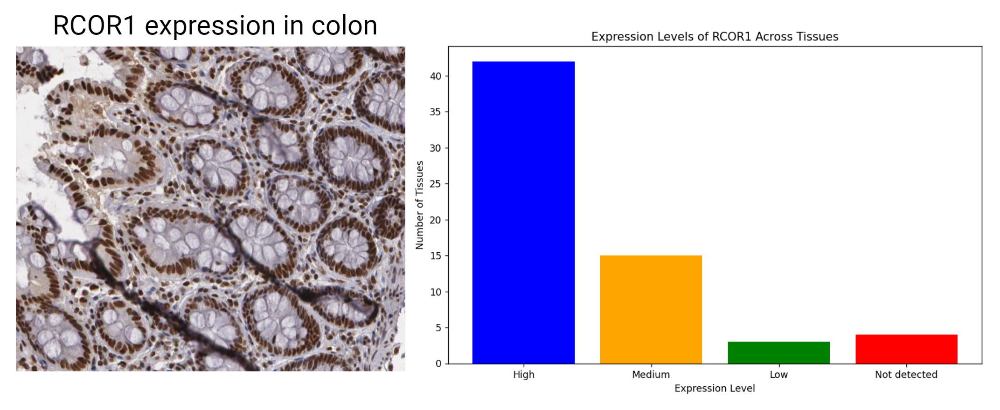

# ProtuMap Panel of Normals
ProtuMap: Protein Expression Map - Panel of Normals

ProtuMap Panel of Normals is a software tool that uses the Human Protein Atlas IHC-based database to explore protein level expression in different tissues. It involves a robust number of proteins, more than 13,000, providing a comprehensive view of protein expression across various tissues.

## Features

- Search for gene expression levels in different tissues.
- Visualize gene expression levels using bar charts.

## Installation

Follow these steps to set up the environment and run the software:

1. **Create the Conda environment**:
    ```sh
    conda env create -f environment.yml
    ```

2. **Activate the Conda environment**:
    ```sh
    conda activate ProtuMap
    ```

3. **Clone the GitHub repository**:
    ```sh
    git clone https://github.com/arvinhm/ProtuMap.git
    ```

4. **Navigate to the project directory**:
    ```sh
    cd ProtuMap
    ```

## Usage

1. **Change the gene name in `main_script.py`**:
    Edit the `main_script.py` file and replace `YOUR_GENE_NAME_HERE` with the gene name you want to search for.

2. **Run the code**:
    ```sh
    python main_script.py
    ```

**Results**

Gene: RCOR1

Not detected in: cerebellum, cerebral cortex, soft tissue 1, testis

High expression in: adipose tissue, adrenal gland, appendix, bone marrow, breast, bronchus, caudate, cerebral cortex, cervix, colon, duodenum, endometrium 1, epididymis, esophagus, gallbladder, heart muscle, hippocampus, kidney, lung, lymph node, nasopharynx, oral mucosa, ovary, pancreas, placenta, prostate, rectum, salivary gland, seminal vesicle, skin 1, skin 2, small intestine, smooth muscle, soft tissue 1, soft tissue 2, stomach 1, stomach 2, testis, thyroid gland, tonsil, urinary bladder, vagina

Medium expression in: appendix, breast, caudate, cerebellum, cerebral cortex, endometrium 2, hippocampus, kidney, liver, lymph node, ovary, skeletal muscle, soft tissue 2, spleen, tonsil

Low expression in: cervix, liver, parathyroid gland
